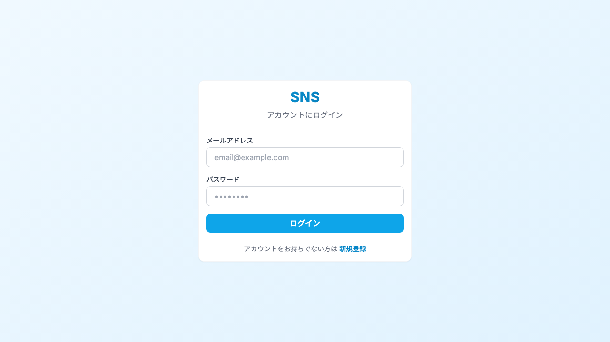
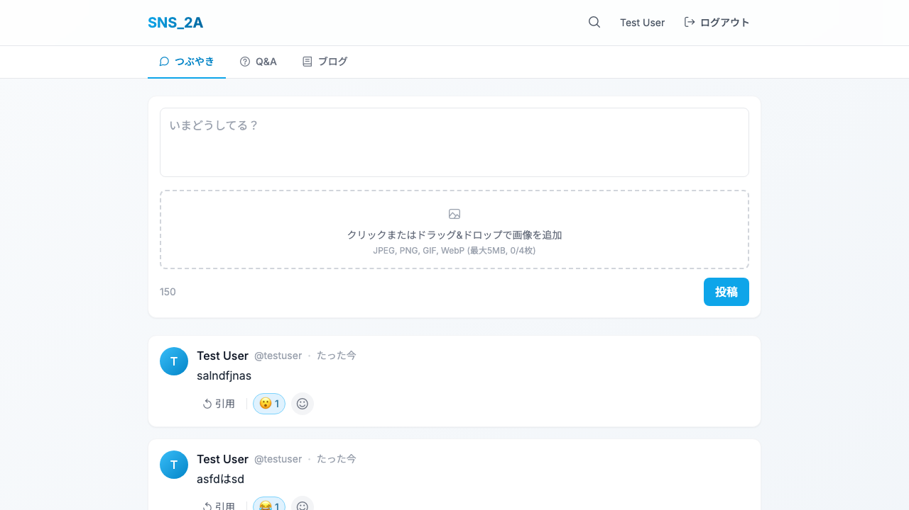
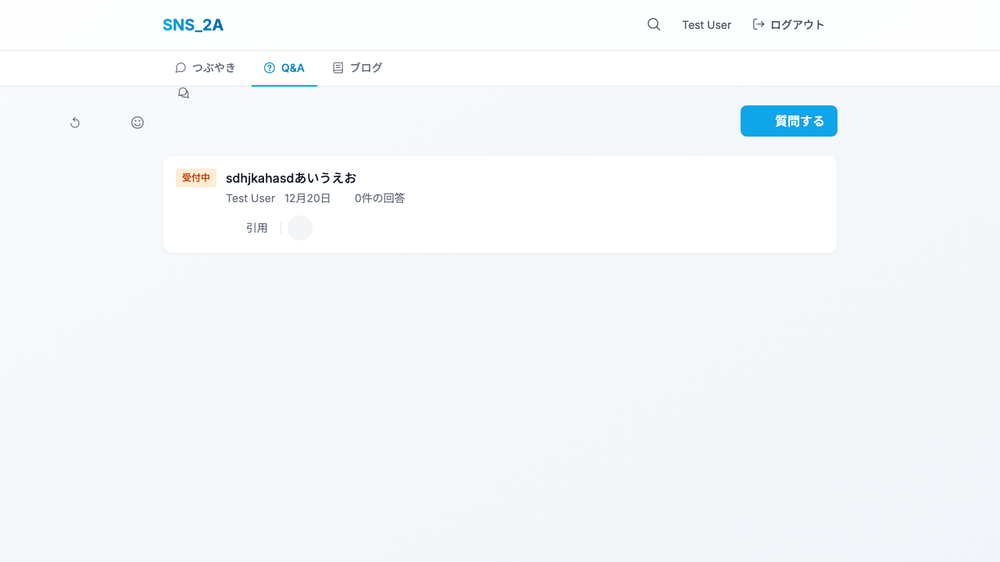
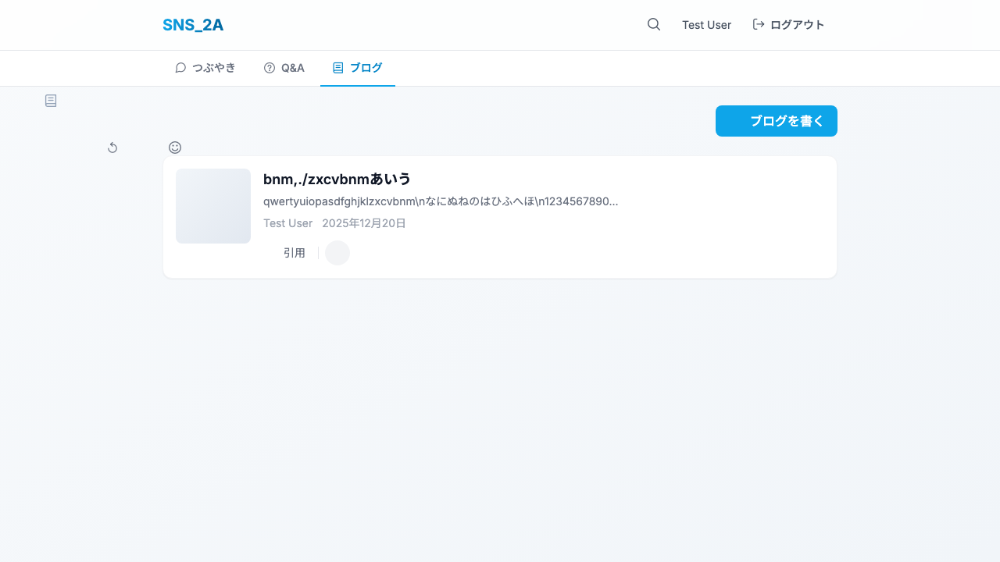
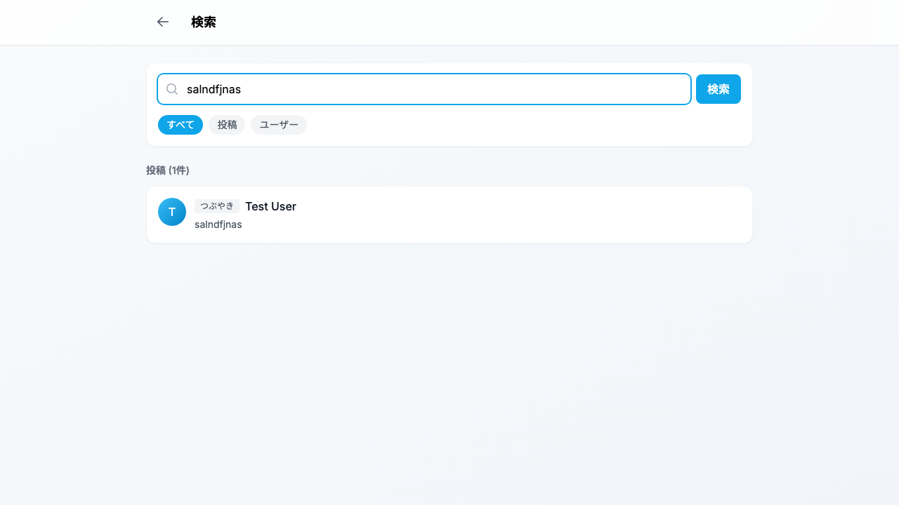

# SNS_2A

つぶやき、Q&A、ブログを統合したソーシャルネットワークサービス

> **⚠️ 注意**
> このプロジェクトは学習・実験目的で作成されたプロトタイプです。セキュリティ対策やパフォーマンス最適化は不十分な可能性があるため、**そのまま本番環境で使用することは推奨されません**。

## 機能一覧

- **つぶやき（マイクロブログ）** - 150文字以内の短文投稿
- **Q&A** - 質問と回答、ベストアンサー機能
- **ブログ** - 10,000文字以内の長文投稿
- **絵文字リアクション** - 8カテゴリの絵文字ピッカー
- **引用機能** - 任意の投稿を引用
- **画像アップロード** - 1投稿最大4枚、5MB/枚、JPEG/PNG/GIF/WebP対応
- **検索機能** - 投稿・ユーザー横断検索
- **ページネーション** - 無限スクロール対応

## スクリーンショット

| ログイン | つぶやき (Feed) |
|---|---|
|  |  |

| Q&A | ブログ |
|---|---|
|  |  |

| 検索結果 | |
|---|---|
|  | |

## セキュリティ機能

- JWT認証（Bearer Token）
- レート制限（認証: 10req/min、API: 100req/min）
- 入力検証・XSSサニタイズ

## 技術スタック

### Backend
- PHP 8.3+
- Slim Framework 4
- Eloquent ORM
- SQLite（開発）/ MariaDB 10.6+（本番）

### Frontend
- Vue 3 + TypeScript
- TailwindCSS
- TanStack Query
- Vite

## セットアップ

### Backend
```bash
cd backend
composer install
cp .env.example .env
# .env を編集
php database/migrate.php
php -S localhost:8080 -t public
```

### Frontend
```bash
cd frontend
npm install
npm run dev
```

## テストアカウント

| Email | Password |
|-------|----------|
| test@example.com | password123 |
| demo@example.com | demo1234 |

## API エンドポイント

| Method | Path | 説明 |
|--------|------|------|
| POST | /api/auth/register | ユーザー登録 |
| POST | /api/auth/login | ログイン |
| GET | /api/me | ユーザー情報取得 |
| GET | /api/search | 検索 |
| GET/POST | /api/feeds | つぶやき一覧/投稿 |
| GET/POST | /api/qa | Q&A一覧/投稿 |
| GET/POST | /api/blogs | ブログ一覧/投稿 |
| POST | /api/upload | 画像アップロード |
| POST | /api/posts/{id}/reactions | リアクション追加 |
| POST | /api/posts/{id}/quotes | 引用投稿 |

## 本番デプロイ

1. `backend/` を `composer install` 後、vendor込みでアップロード
2. `.env` を本番用に設定（MariaDB接続情報）
3. マイグレーション実行: `php database/migrate.php`
4. `frontend/` を `npm run build` 後、`dist/` をアップロード

## ライセンス

MIT

## 🚀 セットアップ方法

### 必要要件
- PHP 8.3+
- Composer
- Node.js & npm

### バックエンド (Backend)
```bash
cd backend
composer install          # 依存関係のインストール
cp .env.example .env      # 環境設定ファイルの作成
php database/migrate.php  # データベース作成 (開発用SQLite)
php -S localhost:8080 -t public   # サーバー起動
```

### フロントエンド (Frontend)
```bash
cd frontend
npm install
npm run dev               # ブラウザで http://localhost:5173 を開く
```

